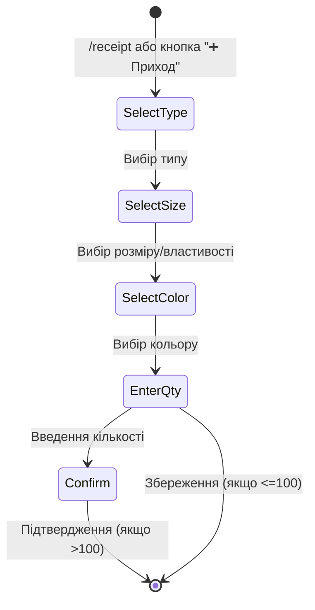

# ТЗ — MVP система контроля остатков заготовок для адресников

## 0. Цель и результат

**Цель:** Создать простую и надежную систему планирования закупок металлических заготовок для адресников без резервирования по заказам.

**Ключевые результаты:**
- Автоматический расчет потребности в заготовках с учетом брака и сроков поставки
- Ежедневные уведомления о необходимости закупки
- Простой учет приходов через Telegram-бот
- Полная прозрачность остатков в Google Sheets

**MVP ограничения:**
- Один склад
- Без резервирования по заказам
- Без интеграции с 1С
- Без автоматического создания заказов поставщикам
- Без прогнозирования сезонности
- Без веб-интерфейса
- Только простой режим расчета (без динамических метрик)

---

## 1. Бизнес-допущения

1. **Заказ в KeyCRM = заготовка будет использована** (добавляем только оформленные заказы)
2. **Один склад** (мультисклад не планируется в MVP)
3. На расход заготовки влияют: **Название товара**, **Размер/свойство**, **Цвет металла**
4. **Резервирования по заказам нет** (FIFO для всех заказов)
5. Брак учитываем коэффициентом **5%** по умолчанию
6. Синхронизация с внешними витринами не требуется
7. **Один заказ = одна заготовка** (qty_per_unit = 1)
8. **Отрицательных остатков быть не может**
9. **Используем украинские названия в маппинге** для простоты

---

## 2. Конфигурация

### 2.1. Основные параметры планирования

| Параметр | Тип | По умолчанию | Описание | Изменяемость |
|----------|-----|--------------|----------|--------------|
| `LEAD_TIME_DAYS` | int | 14 | Срок поставки заготовок в днях | Через Config лист |
| `SCRAP_PCT` | float | 0.05 | Процент брака (5%) | Через Config лист |
| `TARGET_COVER_DAYS` | int | 14 | Дополнительная подушка безопасности | Через Config лист |
| `MIN_STOCK_DEFAULT` | int | 100 | Минимальный остаток по умолчанию | Через Master_Blanks |
| `PAR_STOCK_DEFAULT` | int | 300 | Целевой остаток по умолчанию | Через Master_Blanks |

### 2.2. Режимы расчета

| Параметр | Тип | По умолчанию | Описание |
|----------|-----|--------------|----------|
| `USE_DEMAND_METRICS` | bool | false | Использовать динамический расчет по спросу (отключен в MVP) |

### 2.3. Интеграции

| Параметр | Тип | Обязательный | Описание |
|----------|-----|--------------|----------|
| `KEYCRM_API_TOKEN` | str | Да | API токен KeyCRM |
| `KEYCRM_API_URL` | str | Да | https://api.keycrm.app |
| `KEYCRM_WEBHOOK_SECRET` | str | Да | Секретный ключ для проверки HMAC подписи вебхуков |
| `GSHEETS_ID` | str | Да | ID Google Sheets книги |
| `GOOGLE_CREDENTIALS_JSON` | str | Да | Service Account credentials (JSON) |
| `TELEGRAM_BOT_TOKEN` | str | Да | Токен Telegram бота |
| `TELEGRAM_CHAT_ID` | str | Да | ID чата для уведомлений |
| `TELEGRAM_ALLOWED_USERS` | list | Да | Список user_id с доступом |

### 2.4. Расписание и технические параметры

| Параметр | Тип | По умолчанию | Описание |
|----------|-----|--------------|----------|
| `TIMEZONE` | str | Europe/Kyiv | Часовой пояс |
| `DAILY_REPORT_TIME` | str | 20:00 | Время ежедневного расчета |
| `DAILY_SYNC_TIME` | str | 02:00 | Время ежедневной сверки данных |
| `BATCH_SIZE` | int | 100 | Размер батча для Sheets API |
| `MAX_RETRIES` | int | 3 | Максимум попыток при ошибках |
| `RETRY_DELAY_SECONDS` | int | 1 | Начальная задержка retry |
| `WEBHOOK_ENDPOINT` | str | https://blanks.timosh-design.com/webhook/keycrm | Endpoint для приема вебхуков |

---

## 3. Структура данных

### 3.1. SKU заготовок

**Формат:** `BLK-{TYPE}-{SIZE}-{COLOR}`

**Компоненты SKU:**

| Компонент | Код | Название UA | Описание |
|-----------|-----|-------------|----------|
| **Типы** | | | |
| | `BONE` | кістка | Форма кости |
| | `RING` | бублик | Круглый с отверстием |
| | `ROUND` | круглий | Круглый сплошной |
| | `HEART` | серце | Фигурный в форме сердца |
| | `CLOUD` | хмарка | Фигурный в форме облака |
| | `FLOWER` | квітка | Фигурный в форме цветка |
| **Размеры** | | | |
| | `20` | 20 мм | Маленький |
| | `25` | 25 мм | Средний |
| | `30` | 30 мм | Большой |
| **Цвета** | | | |
| | `GLD` | золото | Золотой металл |
| | `SIL` | срібло | Серебряный металл |

**Полный список SKU (20 позиций):**
```
BLK-BONE-25-GLD    BLK-BONE-25-SIL    BLK-BONE-30-GLD    BLK-BONE-30-SIL
BLK-RING-25-GLD    BLK-RING-25-SIL    BLK-RING-30-GLD    BLK-RING-30-SIL
BLK-ROUND-20-GLD   BLK-ROUND-20-SIL   BLK-ROUND-25-GLD   BLK-ROUND-25-SIL   BLK-ROUND-30-GLD   BLK-ROUND-30-SIL
BLK-HEART-25-GLD   BLK-HEART-25-SIL
BLK-CLOUD-25-GLD   BLK-CLOUD-25-SIL
BLK-FLOWER-25-GLD  BLK-FLOWER-25-SIL
```

### 3.2. Маппинг товаров KeyCRM → заготовки (украинские названия)

| product_name | size_property | metal_color | blank_sku | qty_per_unit | active |
|--------------|---------------|-------------|-----------|--------------|--------|
| Адресник бублик | 25 мм | золото | BLK-RING-25-GLD | 1 | true |
| Адресник бублик | 25 мм | срібло | BLK-RING-25-SIL | 1 | true |
| Адресник бублик | 30 мм | золото | BLK-RING-30-GLD | 1 | true |
| Адресник бублик | 30 мм | срібло | BLK-RING-30-SIL | 1 | true |
| Адресник фігурний | серце | золото | BLK-HEART-25-GLD | 1 | true |
| Адресник фігурний | серце | срібло | BLK-HEART-25-SIL | 1 | true |
| Адресник фігурний | квітка | золото | BLK-FLOWER-25-GLD | 1 | true |
| Адресник фігурний | квітка | срібло | BLK-FLOWER-25-SIL | 1 | true |
| Адресник фігурний | хмарка | золото | BLK-CLOUD-25-GLD | 1 | true |
| Адресник фігурний | хмарка | срібло | BLK-CLOUD-25-SIL | 1 | true |
| Адресник кістка | маленька | золото | BLK-BONE-25-GLD | 1 | true |
| Адресник кістка | маленька | срібло | BLK-BONE-25-SIL | 1 | true |
| Адресник кістка | велика | золото | BLK-BONE-30-GLD | 1 | true |
| Адресник кістка | велика | срібло | BLK-BONE-30-SIL | 1 | true |
| Адресник | 20 мм | золото | BLK-ROUND-20-GLD | 1 | true |
| Адресник | 20 мм | срібло | BLK-ROUND-20-SIL | 1 | true |
| Адресник | 25 мм | золото | BLK-ROUND-25-GLD | 1 | true |
| Адресник | 25 мм | срібло | BLK-ROUND-25-SIL | 1 | true |
| Адресник | 30 мм | золото | BLK-ROUND-30-GLD | 1 | true |
| Адресник | 30 мм | срібло | BLK-ROUND-30-SIL | 1 | true |

---

## 4. Google Sheets структура

**Книга:** `Timosh Blanks Planning`

### 4.1. Лист: Config
Системные параметры (редактируемые пользователем)

| Колонка | Тип | Описание | Пример |
|---------|-----|----------|--------|
| parameter | str | Название параметра | LEAD_TIME_DAYS |
| value | any | Значение | 14 |
| description | str | Описание для пользователя | Срок поставки в днях |
| updated_at | datetime | Последнее изменение | 2025-08-26 14:30:00 |
| updated_by | str | Кто изменил | user@example.com |

### 4.2. Лист: Master_Blanks
Справочник заготовок с параметрами планирования

| Колонка | Тип | Описание | Редактируемое |
|---------|-----|----------|---------------|
| blank_sku | str | Уникальный код | Нет |
| type | str | Тип (BONE/RING/ROUND/HEART/CLOUD/FLOWER) | Нет |
| size_mm | int | Размер в мм | Нет |
| color | str | Цвет (GLD/SIL) | Нет |
| name_ua | str | Название на украинском | Да |
| opening_stock | int | Начальный остаток | Да (один раз) |
| MIN_STOCK | int | Минимальный уровень | Да |
| PAR_STOCK | int | Целевой уровень | Да |
| active | bool | Активность SKU | Да |
| notes | str | Примечания | Да |

### 4.3. Лист: Mapping
Правила маппинга товаров из KeyCRM (украинские названия)

| Колонка | Тип | Описание | Редактируемое |
|---------|-----|----------|---------------|
| product_name | str | Название в KeyCRM (укр.) | Да |
| size_property | str | Размер/свойство (укр.) | Да |
| metal_color | str | Цвет металла (укр.) | Да |
| blank_sku | str | Код заготовки | Да |
| qty_per_unit | int | Кол-во на единицу (всегда 1 в MVP) | Да |
| active | bool | Активность правила | Да |
| priority | int | Приоритет (1-100) | Да |
| created_at | datetime | Дата создания | Нет |

### 4.4. Лист: Movements
Все движения по складу (append-only)

| Колонка | Тип | Описание | Индекс |
|---------|-----|----------|--------|
| id | str | UUID движения | Primary |
| datetime | datetime | Время операции | Index |
| type | enum | order/receipt/correction | Index |
| source_type | str | keycrm_webhook/telegram/manual | |
| source_id | str | ID источника | Index |
| blank_sku | str | Код заготовки | Index |
| qty | int | Количество (+/-) | |
| balance_after | int | Остаток после операции | |
| user | str | Пользователь | |
| note | str | Примечание | |
| hash | str | SHA256 для дедупликации | Unique |

### 4.5. Лист: Current_Stock
Текущие остатки (обновляется после каждого движения)

| Колонка | Тип | Описание |
|---------|-----|----------|
| blank_sku | str | Код заготовки |
| on_hand | int | Текущий остаток |
| reserved | int | Зарезервировано (0 в MVP) |
| available | int | Доступно (=on_hand в MVP) |
| last_receipt_date | date | Последний приход |
| last_order_date | date | Последний расход |
| avg_daily_usage | float | Средний расход/день |
| days_of_stock | int | Дней до исчерпания |
| last_updated | datetime | Последнее обновление |

### 4.6. Лист: Replenishment_Report
Рекомендации по закупкам

| Колонка | Тип | Описание |
|---------|-----|----------|
| blank_sku | str | Код заготовки |
| on_hand | int | Текущий остаток |
| min_level | int | Минимальный уровень |
| reorder_point | int | Точка заказа (=min_level в простом режиме) |
| target_level | int | Целевой уровень |
| need_order | bool | Требуется заказ |
| recommended_qty | int | Рекомендуемое кол-во |
| urgency | enum | critical/high/medium/low |
| estimated_stockout | date | Прогноз исчерпания |
| last_calculated | datetime | Время расчета |

### 4.7. Лист: Unmapped_Items
Позиции без маппинга

| Колонка | Тип | Описание |
|---------|-----|----------|
| datetime | datetime | Время обнаружения |
| order_id | str | ID заказа KeyCRM |
| line_id | str | ID строки заказа |
| product_name | str | Название товара |
| properties | json | Все свойства товара |
| suggested_sku | str | Предполагаемый SKU |
| error_type | str | Тип ошибки |
| resolution | str | Статус решения |

### 4.8. Лист: Audit_Log
Журнал всех действий

| Колонка | Тип | Описание |
|---------|-----|----------|
| timestamp | datetime | Время события |
| user_id | str | ID пользователя |
| user_name | str | Имя пользователя |
| action | str | Тип действия |
| entity | str | Объект действия |
| entity_id | str | ID объекта |
| old_value | json | Старое значение |
| new_value | json | Новое значение |
| source | str | Источник (telegram/sheets/webhook/system) |
| ip_address | str | IP адрес (если доступен) |
| result | str | success/failure |
| error_message | str | Сообщение об ошибке |

### 4.9. Лист: Analytics_Dashboard
Сводная аналитика (обновляется раз в час)

| Метрика | Значение | Тренд | Описание |
|---------|----------|-------|----------|
| total_skus | 20 | → | Всего SKU |
| skus_below_min | 2 | ↑ | Под минимумом |
| total_value | ₴45,000 | ↓ | Стоимость остатков |
| avg_turnover | 12.3 | ↑ | Оборачиваемость |
| stockout_risk | 14% | ↑ | Риск дефицита |

---

## 5. Архитектура системы

### 5.1. Упрощенная модульная архитектура

```
timosh-blanks/
├── src/
│   ├── core/                  # Бизнес-логика
│   │   ├── __init__.py
│   │   ├── models.py          # Pydantic модели
│   │   ├── calculations.py    # Расчеты пополнения (простой режим)
│   │   ├── validators.py      # Валидация данных
│   │   └── exceptions.py      # Кастомные исключения
│   │
│   ├── integrations/          # Внешние сервисы
│   │   ├── __init__.py
│   │   ├── keycrm.py         # KeyCRM API клиент
│   │   ├── sheets.py         # Google Sheets клиент
│   │   └── telegram.py       # Telegram уведомления
│   │
│   ├── services/              # Бизнес-сервисы
│   │   ├── __init__.py
│   │   ├── webhook_service.py # Обработка вебхуков KeyCRM
│   │   ├── sync_service.py   # Ежедневная сверка данных
│   │   ├── stock_service.py  # Управление остатками
│   │   ├── report_service.py # Генерация отчетов
│   │   └── alert_service.py  # Уведомления
│   │
│   ├── webhook/               # Webhook endpoint
│   │   ├── __init__.py
│   │   ├── handlers.py       # Обработчики вебхуков
│   │   ├── auth.py           # HMAC проверка подписи
│   │   └── app.py            # FastAPI приложение
│   │
│   ├── bot/                   # Telegram бот
│   │   ├── __init__.py
│   │   ├── handlers.py       # Обработчики команд
│   │   ├── keyboards.py      # Клавиатуры
│   │   ├── dialogs.py        # Диалоги
│   │   └── middleware.py     # Middleware (auth, logging)
│   │
│   ├── scheduler/             # Планировщик задач
│   │   ├── __init__.py
│   │   ├── jobs.py           # Задачи
│   │   └── runner.py         # Запуск по расписанию
│   │
│   ├── utils/                 # Утилиты
│   │   ├── __init__.py
│   │   ├── logger.py         # Настройка логирования
│   │   ├── retry.py          # Retry декораторы
│   │   └── hash.py           # Хеширование
│   │
│   └── config.py              # Конфигурация
│
├── tests/                     # Тесты
│   ├── unit/                 # Unit тесты
│   ├── integration/          # Интеграционные тесты
│   └── fixtures/             # Тестовые данные
│
├── scripts/                   # Вспомогательные скрипты
│   ├── init_sheets.py        # Создание структуры Sheets
│   ├── migrate.py           # Миграции данных
│   └── backup.py             # Резервное копирование
│
├── deploy/                    # Деплой
│   ├── Dockerfile
│   ├── docker-compose.yml
│   ├── nginx.conf           # Конфиг для webhook endpoint
│   └── kubernetes/           # K8s манифесты (опционально)
│
├── docs/                      # Документация
│   ├── user_guide.md        # Руководство пользователя
│   ├── deployment.md        # Инструкция по развертыванию
│   └── api.md               # API документация
│
├── .env.example              # Пример конфигурации
├── requirements.txt          # Зависимости
├── pyproject.toml           # Конфигурация проекта
├── Makefile                 # Команды разработки
└── README.md                # Описание проекта
```

### 5.2. Технологический стек

| Компонент | Технология | Версия | Обоснование |
|-----------|------------|--------|-------------|
| **Язык** | Python | 3.11+ | Современный, асинхронный |
| **Webhook API** | FastAPI | 0.104+ | Быстрый, async, автодокументация |
| **Фреймворк бота** | aiogram | 3.x | Лучший для Telegram |
| **Валидация** | Pydantic | 2.x | Типизация и валидация |
| **HTTP клиент** | httpx | 0.25+ | Асинхронный, modern |
| **Google Sheets** | gspread | 5.x | Официальная поддержка |
| **Планировщик** | APScheduler | 3.x | Простой и надежный |
| **Логирование** | structlog | 23.x | Структурированные логи |
| **Тесты** | pytest | 7.x | Стандарт для Python |
| **Контейнеризация** | Docker | 24.x | Изоляция и деплой |
| **Веб-сервер** | uvicorn | 0.24+ | ASGI сервер для FastAPI |

### 5.3. Компоненты системы

#### 5.3.1. Webhook Service
- Прием вебхуков от KeyCRM на endpoint `/webhook/keycrm`
- HMAC проверка подписи для безопасности
- Извлечение данных заказов
- Маппинг позиций на заготовки
- Создание движений расхода
- Обработка unmapped items

#### 5.3.2. Sync Service
- Ежедневная сверка данных в 02:00
- Проверка пропущенных заказов
- Контроль целостности данных
- Резервная синхронизация при сбоях

#### 5.3.3. Bot Service
- Авторизация пользователей
- Диалоговый интерфейс для приходов
- Команды для отчетов и корректировок
- Валидация ввода
- Логирование действий

#### 5.3.4. Scheduler Service
- Ежедневный расчет в 20:00
- Генерация отчетов
- Отправка уведомлений
- Очистка старых данных
- Резервное копирование

#### 5.3.5. Stock Calculator (простой режим)
- Агрегация движений
- Расчет текущих остатков
- Сравнение с MIN_STOCK/PAR_STOCK
- Формирование рекомендаций

---

## 6. Алгоритмы и бизнес-логика

### 6.1. Обработка вебхуков KeyCRM

**Событие:** `order.change_order_status` со значением `confirmed`

**Алгоритм:**
1. **Проверка подписи:** HMAC SHA256 с секретным ключом
2. **Извлечение данных:** Получение order_id из контекста
3. **Загрузка заказа:** Запрос полных данных заказа через KeyCRM API
4. **Обработка позиций:** Для каждой позиции заказа:
   - Проверка дубликата по `order_id + line_id`
   - Извлечение атрибутов товара
   - Поиск маппинга по приоритету в Ukrainian названиях
   - Если маппинг найден:
     - Создание Movement с `type='order'` и `source_type='keycrm_webhook'`
     - Обновление Current_Stock
   - Если маппинг не найден:
     - Запись в Unmapped_Items
     - Отправка уведомления (раз в час)
5. **Логирование:** Запись всех операций в Audit_Log

### 6.2. Ежедневная сверка данных

**Время:** 02:00 по Europe/Kyiv

**Алгоритм:**
1. Запрос заказов с `status='confirmed'` за последние 7 дней
2. Сравнение с локальными Movement записями
3. Обработка пропущенных заказов
4. Отчет о расхождениях в Telegram
5. Проверка целостности остатков

### 6.3. Расчет остатков (простой режим)

**Формула:**
```
on_hand = opening_stock + Σ(receipts) - Σ(orders) + Σ(corrections)
```

**Логика пополнения:**
```python
if on_hand <= MIN_STOCK:
    need_order = True
    recommended_qty = PAR_STOCK - on_hand
    
    if on_hand <= MIN_STOCK * 0.5:
        urgency = 'critical'
    elif on_hand <= MIN_STOCK * 0.7:
        urgency = 'high'
    else:
        urgency = 'medium'
```

**Проверки:**
- Если `on_hand < 0` → критическое уведомление (не должно происходить по допущениям)
- Если `on_hand <= MIN_STOCK` → добавить в список закупок

### 6.4. Приоритизация закупок

| Уровень | Условие | Действие |
|---------|---------|----------|
| **Critical** | `on_hand <= MIN_STOCK * 0.5` | Немедленное уведомление |
| **High** | `on_hand <= MIN_STOCK * 0.7` | В ежедневный отчет первыми |
| **Medium** | `on_hand <= MIN_STOCK` | В ежедневный отчет |
| **Low** | `on_hand > MIN_STOCK` | Только в еженедельном отчете |

---

## 7. Telegram бот

### 7.1. Команды и меню

#### Главное меню (inline keyboard)
```
┌─────────────┬─────────────┐
│ ➕ Приход   │ 📦 Остатки  │
├─────────────┼─────────────┤
│ 📊 Отчет    │ ⚙️ Коррекция│
└─────────────┴─────────────┘
```

#### Команды
| Команда | Описание | Доступ |
|---------|----------|--------|
| `/start` | Главное меню | Все авторизованные |
| `/report` | Полный отчет остатков | Все авторизованные |
| `/receipt` | Добавить приход | Все авторизованные |
| `/correction <SKU> <QTY>` | Корректировка | Администраторы |
| `/help` | Справка | Все |
| `/cancel` | Отмена текущей операции | Все |

### 7.2. Сценарий добавления прихода



**Пример диалога:**
```
User: ➕ Приход
Bot: Оберіть тип заготовки:
     [Кістка] [Бублик] [Круглий] [Фігурний]
     
User: Фігурний
Bot: Оберіть форму:
     [Серце] [Квітка] [Хмарка]
     
User: Серце
Bot: Оберіть колір:
     [🟡 Золото] [⚪ Срібло]
     
User: Золото
Bot: Введіть кількість для BLK-HEART-25-GLD:

User: 250
Bot: ⚠️ Підтвердіть приход 250 шт?
     [✅ Так] [❌ Ні]
     
User: Так
Bot: ✅ Додано приход:
     BLK-HEART-25-GLD: +250 шт
     Залишок: 420 шт
```

### 7.3. Авторизация

**Механизм:** Whitelist по Telegram user_id

**Процесс:**
1. Пользователь пишет боту
2. Проверка `user_id` в `TELEGRAM_ALLOWED_USERS`
3. Если не авторизован:
   - Сообщение: "⛔ Доступ заборонено"
   - Логирование попытки
   - Уведомление администратору
4. Если авторизован:
   - Показ главного меню
   - Логирование входа

### 7.4. Уведомления

#### 7.4.1. Ежедневный отчет (20:00)
```
📦 Щоденний звіт • 26.08.2025

🔴 Терміново замовити (2):
• BLK-HEART-25-SIL: 45/100 → замовити 255
• BLK-RING-30-GLD: 30/100 → замовити 270

🟡 Наближаються до мінімуму (3):
• BLK-ROUND-25-SIL: 112/100
• BLK-BONE-30-GLD: 108/100
• BLK-CLOUD-25-SIL: 105/100

✅ Достатній запас: 15 позицій

📊 Детальний звіт: /report
```

#### 7.4.2. Критические уведомления (немедленно)
```
🚨 КРИТИЧНО! Залишок менше 50%!
BLK-FLOWER-25-GLD: 35/100 шт
Терміново потрібно замовити 265 шт!
```

#### 7.4.3. Уведомления об unmapped позициях (раз в час)
```
⚠️ Знайдено позиції без маппінгу (3)

1. Замовлення #12345
   Товар: "Адресник зірка"
   Властивості: 25мм, золото
   
2. Замовлення #12346
   Товар: "Адресник фігурний"
   Властивості: ромб, срібло

Додайте правила в лист Mapping
```

---

## 8. Обработка ошибок и восстановление

### 8.1. Стратегия обработки ошибок

| Тип ошибки | Стратегия | Уведомление | Логирование |
|------------|-----------|-------------|-------------|
| **Webhook недоступен** | Fallback на daily sync | После 3 сбоев | ERROR |
| **API недоступен** | Retry 3x с backoff | После 3 попыток | ERROR |
| **Sheets недоступен** | Локальная очередь | Немедленно | ERROR |
| **Дубликат движения** | Игнорировать | Нет | INFO |
| **Unmapped item** | Запись в лист | Раз в час | WARNING |
| **HMAC проверка** | Отклонить запрос | Немедленно | WARNING |
| **Некорректный ввод** | Подсказка пользователю | В диалоге | INFO |
| **Превышен лимит API** | Пауза до сброса | Администратору | WARNING |

### 8.2. Retry политика

```python
# Конфигурация retry
MAX_RETRIES = 3
BASE_DELAY = 1  # секунда
MAX_DELAY = 60  # секунд
BACKOFF_FACTOR = 2

# Применяется к:
- KeyCRM API calls
- Google Sheets operations  
- Telegram message sending
```

### 8.3. Восстановление после сбоев

#### 8.3.1. При недоступности вебхуков
1. Переключение на ежедневную сверку
2. Уведомление администратора
3. Попытка восстановления каждые 30 минут
4. При восстановлении - возврат к webhook режиму

#### 8.3.2. При недоступности Google Sheets
1. Сохранение операций в локальную SQLite
2. Продолжение работы в деградированном режиме
3. Попытка синхронизации каждые 5 минут
4. При восстановлении - batch upload очереди

#### 8.3.3. При недоступности KeyCRM API
1. Сохранение вебхуков без обработки
2. Уведомление после 3 неудачных попыток
3. Повторная обработка при восстановлении

### 8.4. Идемпотентность операций

**Механизм:** SHA256 хеш от ключевых полей

**Для движений:**
```
hash = SHA256(source_id + blank_sku + qty + type + datetime)
```

**Проверка:**
1. Перед записью - поиск по hash в Movements
2. Если найден - пропуск операции
3. Если не найден - создание записи

---

## 9. Мониторинг и метрики

### 9.1. Ключевые метрики

| Метрика | Описание | Алерт если |
|---------|----------|------------|
| **webhook_success_rate** | % успешных обработок вебхуков | < 95% |
| **sync_success_rate** | % успешных синхронизаций | < 95% |
| **api_response_time** | Время ответа API | > 5 сек |
| **webhook_response_time** | Время обработки вебхука | > 2 сек |
| **unmapped_items_count** | Позиций без маппинга | > 10 |
| **skus_below_critical** | SKU с критически низким остатком | > 0 |
| **bot_response_time** | Время ответа бота | > 2 сек |
| **daily_movements_count** | Движений в день | < 10 или > 1000 |

### 9.2. Логирование

**Формат:** Структурированный JSON

**Уровни:**
- **DEBUG:** Детали операций (в dev режиме)
- **INFO:** Успешные операции
- **WARNING:** Некритичные проблемы
- **ERROR:** Ошибки требующие внимания
- **CRITICAL:** Критические сбои

**Ротация:** Ежедневная, хранение 30 дней

### 9.3. Health checks

| Endpoint | Проверка | Частота |
|----------|----------|---------|
| `/health` | Базовая доступность | 1 мин |
| `/ready` | Готовность к работе | 1 мин |
| `/webhook/keycrm/test` | Тест webhook endpoint | По запросу |

---

## 10. Безопасность

### 10.1. Аутентификация и авторизация

| Компонент | Метод | Описание |
|-----------|-------|----------|
| **KeyCRM Webhooks** | HMAC SHA256 | Проверка подписи секретным ключом |
| **KeyCRM API** | Bearer Token | Только чтение заказов |
| **Google Sheets** | Service Account | Ограниченный доступ к книге |
| **Telegram Bot** | User ID whitelist | Список разрешенных ID |
| **Admin функции** | Отдельный список | Корректировки и настройки |

### 10.2. Защита данных

- Все токены и credentials в переменных окружения
- Не логировать чувствительные данные
- HTTPS для всех внешних соединений
- HMAC проверка подписи вебхуков
- Хеширование для дедупликации без хранения данных
- Регулярное резервное копирование Google Sheets

### 10.3. Rate limiting

| Сервис | Лимит | Действие при превышении |
|--------|-------|-------------------------|
| **KeyCRM API** | 100/мин | Пауза до сброса |
| **Google Sheets** | 100/100сек | Батчинг операций |
| **Telegram** | 30/сек | Очередь сообщений |
| **Webhook endpoint** | 1000/час | Rate limit по IP |

---

## 11. Deployment и инфраструктура

### 11.1. Требования к серверу

| Параметр | Минимум | Рекомендуется |
|----------|---------|---------------|
| **CPU** | 1 core | 2 cores |
| **RAM** | 512 MB | 1 GB |
| **Disk** | 5 GB | 10 GB |
| **OS** | Ubuntu 20.04+ | Ubuntu 22.04 |
| **Docker** | 20.10+ | Latest stable |
| **Network** | 10 Mbps | 100 Mbps |
| **SSL** | Let's Encrypt | Для webhook endpoint |

### 11.2. Docker контейнеры

```yaml
services:
  webhook:
    image: timosh-blanks:latest
    command: uvicorn src.webhook.app:app --host 0.0.0.0 --port 8000
    ports:
      - "8000:8000"
    environment:
      - ENV_FILE=.env
    volumes:
      - ./data:/app/data
      - ./logs:/app/logs
    restart: unless-stopped
    
  scheduler:
    image: timosh-blanks:latest
    command: python -m src.scheduler.runner
    environment:
      - ENV_FILE=.env
    volumes:
      - ./data:/app/data
      - ./logs:/app/logs
    restart: unless-stopped
    
  bot:
    image: timosh-blanks:latest  
    command: python -m src.bot
    environment:
      - ENV_FILE=.env
    volumes:
      - ./data:/app/data
      - ./logs:/app/logs
    restart: unless-stopped

  nginx:
    image: nginx:alpine
    ports:
      - "80:80"
      - "443:443"
    volumes:
      - ./deploy/nginx.conf:/etc/nginx/nginx.conf
      - ./ssl:/etc/ssl
    restart: unless-stopped
```

### 11.3. Переменные окружения

```env
# KeyCRM
KEYCRM_API_TOKEN=your_token_here
KEYCRM_API_URL=https://api.keycrm.app
KEYCRM_WEBHOOK_SECRET=your_webhook_secret

# Google Sheets
GSHEETS_ID=1234567890abcdef
GOOGLE_CREDENTIALS_JSON={"type":"service_account"...}

# Telegram
TELEGRAM_BOT_TOKEN=123456:ABC-DEF
TELEGRAM_CHAT_ID=-1001234567890
TELEGRAM_ALLOWED_USERS=123456789,987654321
TELEGRAM_ADMIN_USERS=123456789

# Webhook
WEBHOOK_ENDPOINT=https://blanks.timosh-design.com/webhook/keycrm

# Planning
LEAD_TIME_DAYS=14
SCRAP_PCT=0.05
TARGET_COVER_DAYS=14
MIN_STOCK_DEFAULT=100
PAR_STOCK_DEFAULT=300

# Schedule
TIMEZONE=Europe/Kyiv
DAILY_REPORT_TIME=20:00
DAILY_SYNC_TIME=02:00

# Mode (Simple mode only in MVP)
USE_DEMAND_METRICS=false

# Technical
LOG_LEVEL=INFO
LOG_FORMAT=json
MAX_RETRIES=3
BATCH_SIZE=100
```

---

## 12. План реализации

### Этап 1: Подготовка инфраструктуры (1 день)
- [x] Создание репозитория и структуры проекта
- [ ] Настройка Google Cloud Service Account
- [ ] Создание Google Sheets книги с обновленными листами (20 SKU)
- [ ] Создание Telegram бота через BotFather
- [ ] Настройка поддомена blanks.timosh-design.com
- [ ] Настройка SSL сертификата
- [ ] Базовая конфигурация через Pydantic

### Этап 2: Интеграции (2 дня)
- [ ] Клиент Google Sheets с retry логикой
- [ ] Клиент KeyCRM API с пагинацией
- [ ] Webhook endpoint на FastAPI с HMAC проверкой
- [ ] Базовый Telegram бот с авторизацией
- [ ] Интеграционные тесты для каждого клиента

### Этап 3: Бизнес-логика (2 дня)
- [ ] Модели данных (Movement, Stock, SKU) с украинским маппингом
- [ ] Сервис обработки вебхуков KeyCRM
- [ ] Калькулятор остатков (простой режим MIN/PAR)
- [ ] Сервис генерации отчетов
- [ ] Unit тесты для расчетов

### Этап 4: Telegram бот (2 дня)
- [ ] Структура диалогов на aiogram 3 с поддержкой всех типов заготовок
- [ ] Inline клавиатуры для навигации (включая фигурные формы)
- [ ] Обработчики команд и callback
- [ ] Валидация ввода и error handling
- [ ] Логирование действий пользователей

### Этап 5: Автоматизация (1 день)
- [ ] Настройка APScheduler
- [ ] Job для ежедневного расчета (20:00)
- [ ] Job для ежедневной сверки данных (02:00)
- [ ] Сервис уведомлений
- [ ] Мониторинг и health checks

### Этап 6: Deployment (1 день)
- [ ] Dockerfile и docker-compose с nginx
- [ ] Настройка KeyCRM webhook на blanks.timosh-design.com
- [ ] CI/CD pipeline (GitHub Actions)
- [ ] Документация пользователя
- [ ] Скрипты миграции и backup
- [ ] Развертывание на VPS Ubuntu

### Этап 7: Тестирование и отладка (1 день)
- [ ] E2E тестирование полного цикла с вебхуками
- [ ] Тестирование обработки всех 20 SKU
- [ ] Тестирование восстановления после сбоев
- [ ] Финальная отладка и оптимизация

**Итого: 10 рабочих дней**

---

## 13. Критерии приемки

### 13.1. Функциональные требования

| Требование | Критерий | Метод проверки |
|------------|----------|----------------|
| Webhook обработка | 100% вебхуков без потерь | Лог webhook endpoint |
| Дедупликация | 0 дубликатов движений | Проверка по hash |
| Маппинг украинских названий | >95% успешный маппинг | Отчет Unmapped |
| Расчет остатков (простой режим) | Точность 100% | Сверка с ручным расчетом |
| Обработка 20 SKU | Все позиции поддерживаются | Тест всех типов заготовок |
| Уведомления | Доставка в течение 1 мин | Лог времени отправки |
| Telegram бот | Время ответа <2 сек | Замер response time |

### 13.2. Нефункциональные требования

| Требование | Критерий | Метод проверки |
|------------|----------|----------------|
| Доступность webhook | >99.5% uptime | Мониторинг |
| Производительность | Обработка вебхука <1 сек | Бенчмарк |
| Масштабируемость | До 50 SKU без изменений | Тест с данными |
| Безопасность | 0 утечек credentials, HMAC работает | Security audit |
| Восстановление | <5 мин после сбоя | Disaster recovery test |

### 13.3. Документация

- [ ] README с quick start
- [ ] Руководство пользователя (UA)
- [ ] Инструкция по настройке KeyCRM webhook
- [ ] Инструкция по deployment
- [ ] Описание API и структуры данных
- [ ] Troubleshooting guide

---

## 14. Риски и митигация

| Риск | Вероятность | Влияние | Митигация | Ответственный |
|------|-------------|---------|-----------|---------------|
| **Изменение API KeyCRM** | Средняя | Высокое | Версионирование, валидация ответов | Dev team |
| **Недоступность вебхуков** | Низкая | Среднее | Fallback на daily sync | Dev team |
| **Лимиты Google Sheets** | Низкая | Среднее | Батчинг, кеширование, fallback на SQLite | Dev team |
| **Некорректный маппинг** | Средняя | Высокое | Валидация, ручная проверка, алерты | Business |
| **Ошибки в расчетах** | Низкая | Критическое | Тесты, code review, staging среда | Dev + QA |
| **HMAC атаки** | Низкая | Высокое | Сильный секретный ключ, мониторинг | DevOps |
| **Превышение бюджета** | Низкая | Среднее | Мониторинг использования API | PM |
| **Потеря данных** | Низкая | Критическое | Backup, версионирование Sheets | DevOps |

---

## 15. Дальнейшее развитие

### Phase 1.1 (Месяц 2)
- [ ] Динамический расчет по спросу (SMA, EMA)
- [ ] Графики и дашборды в Google Sheets
- [ ] Экспорт отчетов в PDF
- [ ] Поддержка новых форм заготовок
- [ ] Улучшенная аналитика маппинга

### Phase 1.2 (Месяц 3)
- [ ] Веб-интерфейс на React для управления маппингом
- [ ] REST API для интеграций
- [ ] Прогнозирование с ML (Prophet)
- [ ] ABC/XYZ анализ
- [ ] Поддержка множественных складов

### Phase 2.0 (Месяцы 4-6)
- [ ] Мультитенантность
- [ ] Автоматические заказы поставщикам
- [ ] Резервирование под заказы
- [ ] Мобильное приложение
- [ ] BI аналитика

---

## 16. Контакты и ресурсы

### Команда проекта
- **Product Owner:** [TBD]
- **Tech Lead:** [TBD]
- **QA Lead:** [TBD]

### Ресурсы
- **Repository:** github.com/[org]/timosh-blanks
- **Webhook endpoint:** https://blanks.timosh-design.com/webhook/keycrm
- **Documentation:** docs.timosh-blanks.com
- **Production:** blanks.timosh-design.com

### Внешние ресурсы
- [KeyCRM API Docs](https://api.keycrm.app/docs)
- [KeyCRM Webhook Setup](https://help.keycrm.app/uk/process-automation-api-and-more/webhook-setup-in-keycrm)
- [Google Sheets API](https://developers.google.com/sheets/api)
- [Telegram Bot API](https://core.telegram.org/bots/api)
- [aiogram Documentation](https://docs.aiogram.dev)

---

## Приложения

### Приложение A: Словарь терминов

| Термин | Определение |
|--------|-------------|
| **SKU** | Stock Keeping Unit - уникальный код заготовки |
| **Movement** | Движение товара (приход/расход/корректировка) |
| **MIN_STOCK** | Минимальный уровень остатков |
| **PAR_STOCK** | Целевой уровень остатков |
| **Webhook** | HTTP callback для уведомления о событиях |
| **HMAC** | Hash-based Message Authentication Code |
| **Unmapped** | Позиции без правила маппинга |
| **Простой режим** | Расчет по фиксированным MIN/PAR уровням |

### Приложение B: Формат данных KeyCRM webhook

```json
{
  "event": "order.change_order_status",
  "context": {
    "id": 12345,
    "status": "confirmed",
    "client_id": 88282,
    "grand_total": 450.00,
    "created_at": "2025-08-26T10:30:00Z",
    "updated_at": "2025-08-26T10:35:00Z"
  }
}
```

### Приложение C: Примеры уведомлений

**Критическое:**
```
🚨 КРИТИЧНО! Залишок менше 50%!
BLK-HEART-25-GLD: 35/100 шт
Терміново потрібно замовити 265 шт!
```

**Ежедневное:**
```
📦 Щоденний звіт • 26.08.2025 20:00

🔴 Критично низький рівень (2):
• BLK-FLOWER-25-SIL: 45 → замовити 255
• BLK-CLOUD-25-GLD: 30 → замовити 270

🟡 Потребують уваги (3):
• BLK-ROUND-25-SIL: 112 (7 днів)
• BLK-BONE-30-GLD: 108 (6 днів)  
• BLK-RING-25-SIL: 105 (5 днів)

✅ Достатній запас: 15 SKU

Детальний звіт: /report
```

**Успешная операция:**
```
✅ Приход успішно додано!

SKU: BLK-HEART-25-GLD
Кількість: +200 шт
Залишок: 520 шт
Користувач: Іван Петров
Час: 26.08.2025 14:30
```

**Unmapped позиция:**
```
⚠️ Нова позиція без маппінгу

Замовлення #12345
Товар: "Адресник зірка преміум"
Властивості: {"size": "25мм", "metal_color": "золото"}
Пропонований SKU: BLK-STAR-25-GLD

Додайте правило в лист Mapping:
• product_name: Адресник зірка преміум
• size_property: 25мм  
• metal_color: золото
• blank_sku: BLK-STAR-25-GLD
```

---

*Документ версії 2.0 від 26.08.2025*